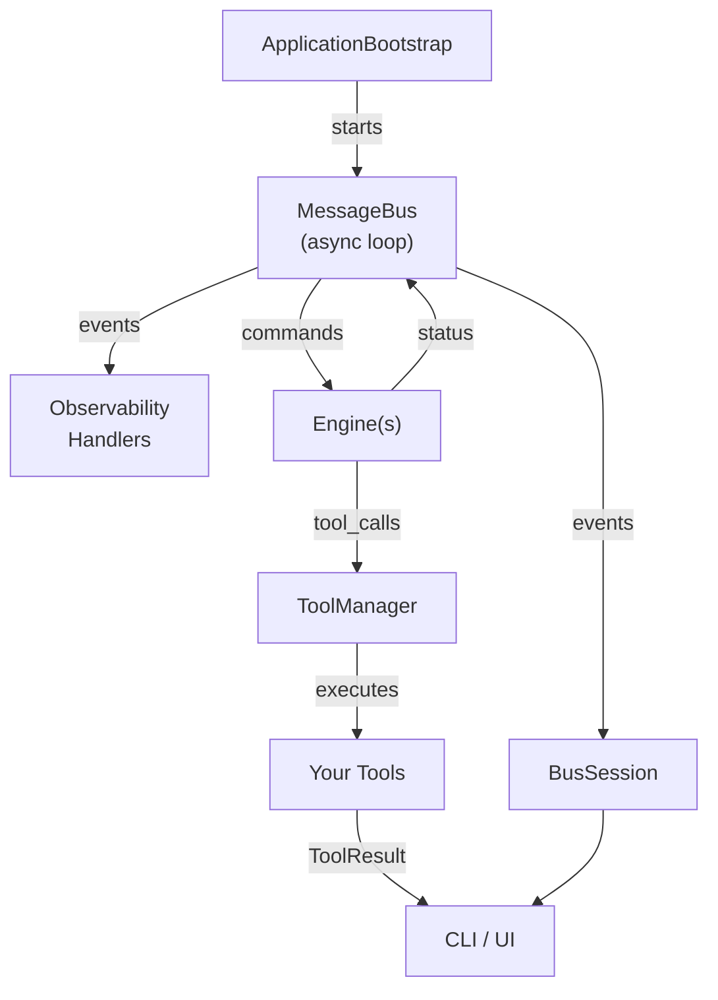

# 🌌 **LLMgine**

LLMgine is a _pattern-driven_ framework for building **production-grade, tool-augmented LLM applications** in Python.  
It offers a clean separation between _**engines**_ (conversation logic), _**models/providers**_ (LLM back-ends), _**tools**_ (function calling), a streaming **message-bus** for commands & events, and opt-in **observability**.  
Think _FastAPI_ for web servers or _Celery_ for tasks—LLMgine plays the same role for complex, chat-oriented AI.

---

## 🚀 **Enhanced Features and Extensions**

This forked repository extends the base llmgine framework with comprehensive enhancements designed for university club deployment and enterprise-grade applications. The extensions transform the basic LLM framework into a sophisticated AI platform that balances advanced functionality with accessibility for non-technical users.

### **Advanced Architecture Implementation**

The enhanced version implements three core design patterns that address common scalability and maintainability challenges in LLM applications:

**Singleton Pattern for Configuration Management** - Centralizes configuration across all system components, eliminating configuration drift and providing unified performance metrics tracking. This ensures consistent behavior throughout the application lifecycle and simplifies deployment management.

**Observer Pattern for Real-Time Monitoring** - Enables comprehensive monitoring of tool executions with automated performance tracking, security auditing, and optimization recommendations. The system provides real-time feedback on execution times, failure rates, and potential security concerns without manual intervention.

**Mediator Pattern for Component Communication** - Facilitates sophisticated inter-component messaging while maintaining loose coupling between system modules. This approach significantly improves debugging capabilities and system observability by centralizing communication coordination.

### **Creative AI Tool Suite**

Four specialized AI tools provide immediate practical value for diverse organizational needs:

**Advanced Code Analysis Engine** - Performs comprehensive static analysis including complexity metrics calculation, anti-pattern detection, and optimization recommendations. The tool evaluates code quality using industry-standard benchmarks and provides actionable improvement suggestions with implementation guidance.

**Intelligent Research Platform** - Synthesizes information from multiple sources with built-in fact-checking and bias detection capabilities. The system provides confidence scoring for research conclusions, source credibility assessment, and automated literature review assistance with citation-ready outputs.

**System Performance Profiling Tool** - Offers comprehensive resource utilization analysis without external dependencies. The profiler identifies performance bottlenecks, provides optimization pathways, and generates benchmarking reports against industry standards.

**Database Intelligence System** - Analyzes database schemas for security vulnerabilities and performance optimization opportunities. The tool provides index recommendations, query efficiency suggestions, and data quality assessments with integrity validation.

### **Production-Ready Infrastructure**

The enhanced implementation includes enterprise-grade infrastructure components essential for reliable deployment:

**Error Resilience and Recovery** - Implements exponential backoff retry mechanisms for external API calls, comprehensive exception handling with specific error types, and graceful degradation strategies under system stress conditions.

**Performance Optimization Systems** - Features intelligent caching with automatic invalidation, request deduplication to prevent redundant operations, and dynamic resource scaling recommendations based on usage patterns.

**Security and Compliance Framework** - Provides real-time threat assessment for tool executions, data access auditing with permission validation, and compliance-ready data handling suitable for university and enterprise environments.

### **University-Specific Adaptations**

The architecture has been specifically adapted to support multi-club deployment scenarios common in university environments:

**Modular Component Architecture** - Enables selective feature deployment based on individual organizational needs, allowing clubs to adopt specific tools without requiring full system implementation.

**Resource Sharing Mechanisms** - Facilitates inter-club collaboration while maintaining appropriate access controls and data isolation between different organizations.

**Scalable Multi-Tenant Design** - Supports concurrent usage across multiple organizations without performance degradation, with built-in resource management and load balancing capabilities.

---

## ✨ Feature Highlights
| Area | What you get | Key files |
|------|--------------|-----------|
| **Engines** | Plug-n-play `Engine` subclasses (`SinglePassEngine`, `ToolChatEngine`, …) with session isolation, tool-loop orchestration, and CLI front-ends | `engines/*.py`, `src/llmgine/llm/engine/` |
| **Enhanced Engines** | Advanced Chat Engine integrating design patterns, AI tools, and production-ready features | `programs/engine/advanced_chat_engine.py` |
| **Design Patterns** | Singleton, Observer, and Mediator pattern implementations for enterprise architecture | `programs/engine/advanced_design_patterns.py` |
| **Creative AI Tools** | Code analysis, research platform, performance profiling, and database intelligence | `programs/engine/creative_ai_tools.py` |
| **Message Bus** | Async **command bus** (1 handler) + **event bus** (N listeners) + **sessions** for scoped handlers | `src/llmgine/bus/` |
| **Tooling** | Declarative function-to-tool registration, multi-provider JSON-schema parsing (OpenAI, Claude, DeepSeek), async execution pipeline | `src/llmgine/llm/tools/` |
| **Providers / Models** | Wrapper classes for OpenAI, OpenRouter, Gemini 2.5 Flash etc. _without locking you in_ | `src/llmgine/llm/providers/`, `src/llmgine/llm/models/` |
| **Context Management** | Simple and in-memory chat history managers, event-emitting for retrieval/update | `src/llmgine/llm/context/` |
| **UI** | Rich-powered interactive CLI (`EngineCLI`) with live spinners, confirmation prompts, tool result panes | `src/llmgine/ui/cli/` |
| **Observability** | Console + JSONL file handlers, per-event metadata, easy custom sinks | `src/llmgine/observability/` |
| **Bootstrap** | One-liner `ApplicationBootstrap` that wires logging, bus startup, and observability | `src/llmgine/bootstrap.py` |

---

## 🏗️ High-Level Architecture



*Every component communicates _only_ through the bus, so engines, tools, and UIs remain fully decoupled.*

---

## 🚀 Quick Start

### 1. Install

```bash
git clone https://github.com/your-org/llmgine.git
cd llmgine
python -m venv .venv && source .venv/bin/activate
pip install -e ".[openai]"   # extras: openai, openrouter, dev, …
export OPENAI_API_KEY="sk-…" # or OPENROUTER_API_KEY / GEMINI_API_KEY
```

### 2. Run the demo CLI

```bash
python -m llmgine.engines.single_pass_engine  # pirate translator
# or
python -m llmgine.engines.tool_chat_engine    # automatic tool loop
# or
python programs/engine/advanced_chat_engine.py  # enhanced version with all features
```

You'll get an interactive prompt with live status updates and tool execution logs.

### 3. Explore Enhanced Features

```bash
# Run comprehensive feature demonstration
python programs/engine/comprehensive_demo.py

# Test design pattern implementations
python programs/engine/advanced_design_patterns.py

# Explore database integration capabilities
python programs/engine/explore_database.py
```

---

## 🧠 **Enhanced Engine Capabilities**

### **Advanced Chat Engine**
The `AdvancedChatEngine` extends the base engine with sophisticated features designed for production deployment:

```python
from advanced_chat_engine import AdvancedChatEngine
from llmgine.llm import SessionID

# Initialize enhanced engine with session management
engine = AdvancedChatEngine(SessionID("university-club-session"))

# Execute complex analysis tasks
await engine.handle_command(AdvancedChatEngineCommand(
    prompt="Analyze this Python codebase for optimization opportunities and security vulnerabilities"
))
```

### **Integrated AI Tool Suite**
The enhanced engine includes four specialized tools that address common organizational needs:

- **Code Analysis**: Complexity metrics, optimization suggestions, anti-pattern detection, and maintainability scoring
- **Research Platform**: Multi-source information synthesis, fact-checking, bias detection, and confidence assessment  
- **Performance Profiling**: Resource analysis, bottleneck identification, optimization recommendations, and benchmarking
- **Database Intelligence**: Schema analysis, security assessment, performance optimization, and data quality validation

### **Enterprise Design Patterns**
The architecture implements proven design patterns that ensure reliability and maintainability:

- **Singleton Pattern**: Centralized configuration management with automatic performance tracking
- **Observer Pattern**: Real-time monitoring and automated optimization with security auditing
- **Mediator Pattern**: Decoupled component communication with enhanced debugging capabilities

---

## 🧑‍💻 Building Your Own Engine

```python
from llmgine.llm.engine.engine import Engine
from llmgine.messages.commands import Command, CommandResult
from llmgine.bus.bus import MessageBus

class MyCommand(Command):
    prompt: str = ""

class MyEngine(Engine):
    def __init__(self, session_id: str):
        self.session_id = session_id
        self.bus = MessageBus()

    async def handle_command(self, cmd: MyCommand) -> CommandResult:
        await self.bus.publish(Status("thinking", session_id=self.session_id))
        # call LLM or custom logic here …
        answer = f"Echo: {cmd.prompt}"
        await self.bus.publish(Status("finished", session_id=self.session_id))
        return CommandResult(success=True, result=answer)

# Wire into CLI
from llmgine.ui.cli.cli import EngineCLI
chat = EngineCLI(session_id="demo")
chat.register_engine(MyEngine("demo"))
chat.register_engine_command(MyCommand, MyEngine("demo").handle_command)
await chat.main()
```

---

## 🔧 Registering Tools in 3 Lines

```python
from llmgine.llm.tools.tool import Parameter
from llmgine.engines.tool_chat_engine import ToolChatEngine

def get_weather(city: str):
    """Return current temperature for a city.
    Args:
        city: Name of the city
    """
    return f"{city}: 17 °C"

engine = ToolChatEngine(session_id="demo")
await engine.register_tool(get_weather)               # ← introspection magic ✨
```

The engine now follows the **OpenAI function-calling loop**:

```
User → Engine → LLM (asks to call get_weather) → ToolManager → get_weather()
          ↑                                        ↓
          └───────────    context update   ────────┘ (loops until no tool calls)
```

---

## 📰 Message Bus in Depth

```python
from llmgine.bus.bus import MessageBus
from llmgine.bus.session import BusSession

bus = MessageBus()
await bus.start()

class Ping(Command): pass
class Pong(Event): msg: str = "pong!"

async def ping_handler(cmd: Ping):
    await bus.publish(Pong(session_id=cmd.session_id))
    return CommandResult(success=True)

with bus.create_session() as sess:
    sess.register_command_handler(Ping, ping_handler)
    sess.register_event_handler(Pong, lambda e: print(e.msg))
    await sess.execute_with_session(Ping())      # prints "pong!"
```

*Handlers are **auto-unregistered** when the `BusSession` exits—no leaks.*

---

## 📊 Observability

Add structured logs with zero boilerplate:

```python
from llmgine.bootstrap import ApplicationBootstrap, ApplicationConfig
config = ApplicationConfig(enable_console_handler=True,
                           enable_file_handler=True,
                           log_level="debug")
await ApplicationBootstrap(config).bootstrap()
```

*All events/commands flow through `ConsoleEventHandler` and `FileEventHandler`
to a timestamped `logs/events_*.jsonl` file.*

---

## 📁 Repository Layout (abridged)

```
llmgine/
│
├─ engines/            # Turn-key example engines (single-pass, tool chat, …)
├─ programs/engine/    # Enhanced engines with advanced features
│   ├─ advanced_chat_engine.py         # Main enhanced engine implementation
│   ├─ advanced_design_patterns.py     # Design pattern implementations
│   ├─ creative_ai_tools.py            # Specialized AI tool collection
│   ├─ comprehensive_demo.py           # Feature demonstration system
│   └─ explore_database.py             # Database integration capabilities
└─ src/llmgine/
   ├─ bus/             # Message bus core + sessions
   ├─ llm/
   │   ├─ context/     # Chat history & context events
   │   ├─ engine/      # Engine base + dummy
   │   ├─ models/      # Provider-agnostic model wrappers
   │   ├─ providers/   # OpenAI, OpenRouter, Gemini, Dummy, …
   │   └─ tools/       # ToolManager, parser, register, types
   ├─ observability/   # Console & file handlers, log events
   └─ ui/cli/          # Rich-based CLI components
```

---

## 🎯 **University Club Applications**

### **Business & Economics Organizations**
- Automated budget analysis with optimization recommendations and financial forecasting
- Market research capabilities with multi-source verification and trend analysis
- Performance analytics for events, initiatives, and strategic planning

### **Engineering & Technology Societies**  
- Code review automation for hackathon projects with quality assessments and optimization suggestions
- Website and system performance optimization with detailed bottleneck analysis
- Database schema analysis for membership systems with security and efficiency recommendations

### **Research & Academic Groups**
- Literature review assistance with source credibility checking and bias detection
- Data analysis capabilities with statistical pattern identification and visualization
- Grant opportunity research with automated proposal optimization and success probability assessment

### **Social & Cultural Organizations**
- Event planning optimization based on historical attendance patterns and resource allocation
- Social media strategy analysis with engagement optimization and content recommendations
- Resource allocation optimization for activities, equipment, and budget management

---

## 🏁 Roadmap

- [ ] **Streaming responses** with incremental event dispatch  
- [ ] **WebSocket / FastAPI** front-end (drop-in replacement for CLI)  
- [ ] **Persistent vector memory** layer behind `ContextManager`  
- [ ] **Plugin system** for third-party Observability handlers  
- [ ] **More providers**: Anthropic, Vertex AI, etc.
- [ ] **University integration APIs** for student portal connectivity and academic system integration
- [ ] **Multi-club collaboration features** for resource sharing and joint initiative coordination
- [ ] **Mobile application interface** for enhanced accessibility and remote management

---

## 🤝 Contributing

1. Fork & create a feature branch  
2. Ensure `pre-commit` passes (`ruff`, `black`, `isort`, `pytest`)  
3. Open a PR with context + screenshots/GIFs if UI-related  

---

## 📄 License

LLMgine is distributed under the **MIT License**—see [`LICENSE`](LICENSE) for details.

---

## 🎓 **DSCubed Integration and University Adoption**

This enhanced implementation supports DSCubed's vision to expand LLM technology adoption across University of Melbourne student clubs. The architecture balances sophisticated functionality with accessibility, ensuring that organizations with varying technical expertise can effectively leverage AI capabilities.

The modular design allows clubs to adopt specific features based on their needs while maintaining the flexibility to expand functionality as requirements evolve. The system's emphasis on practical problem-solving and immediate value delivery makes it particularly suitable for university environments where demonstrable benefits are essential for technology adoption.

The comprehensive documentation, built-in monitoring, and user-friendly interfaces ensure that the transition to AI-enhanced operations is smooth and sustainable for diverse organizational contexts.

> _"Build architecturally sound LLM apps, not spaghetti code.  
> Welcome to the engine room."_
